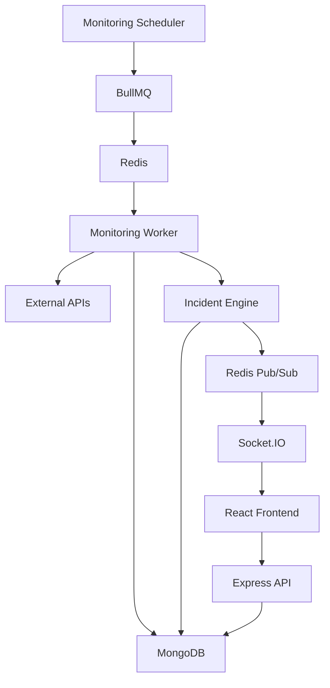

# API Sentinel
API Sentinel is a full-stack API monitoring and incident management platform that continuously checks configured APIs, detects failures, creates incidents, and provides real-time updates through a web dashboard.

## Project Status

The API Sentinel MVP has been implemented, deployed, and manually verified across its main application flows.

**Live Application:** https://api-sentinel-frontend-0j9o.onrender.com

**Backend API:** https://api-sentinel-backend-server.onrender.com

### Deployment Notes

- The frontend and backend are deployed on Render.
- MongoDB Atlas is used for persistent application data.
- Redis and BullMQ support scheduled monitoring jobs and background processing.
- The monitoring worker currently runs alongside the backend in the same Render web service to avoid the cost of a separate background worker.
- The application uses free-tier hosting resources. Services may sleep after inactivity, and the free Redis service does not provide persistent storage. Continuous monitoring is therefore not guaranteed.

## Features

- User registration and login with JWT authentication
- Create, edit, enable, disable, and delete API monitors
- Scheduled API health checks using BullMQ workers
- Check history with response status, response time, and errors
- Automatic incident creation after consecutive failures
- Incident acknowledgement and resolution
- Real-time monitor and incident updates using Socket.IO
- Dashboard with monitor health and incident statistics
- Monitor analytics and response-time charts using Recharts

## Project Highlights

- Designed a background monitoring pipeline using a scheduler, BullMQ, Redis, and a dedicated monitoring worker.
- Implemented consecutive-failure detection and automated incident creation and recovery.
- Built real-time monitor and incident updates using Socket.IO with a Redis Pub/Sub bridge.
- Implemented JWT-based authentication and protected API routes.
- Built monitor check history and analytics for tracking API health and response times.
- Developed a React dashboard for monitoring API health, incidents, and analytics.

## Tech Stack

### Frontend
- React
- React Router
- Socket.IO Client
- Recharts
- Vite

### Backend
- Node.js
- Express.js
- MongoDB
- Mongoose
- JWT
- bcrypt

### Background Processing & Real-Time
- Redis
- BullMQ
- Socket.IO
- Redis Pub/Sub

### Development & Tools

- Git & GitHub
- Postman
- Docker
- Docker Compose
- Nginx
- Render
- MongoDB Atlas
- Visual Studio Code 

## Architecture

API Sentinel follows a background-job-based monitoring architecture:


### Monitoring Flow

1. The scheduler identifies monitors that are due for a check.
2. A monitoring job is added to the BullMQ queue.
3. Redis manages the queued job.
4. The monitoring worker processes the job.
5. The worker sends an HTTP request to the monitored API.
6. The check result is stored in MongoDB.
7. The incident engine evaluates failures and recovery conditions.
8. Relevant events are published through Redis Pub/Sub.
9. Socket.IO delivers real-time events to connected React clients.
10. The frontend updates the dashboard without requiring a page refresh.

### Incident Management

API Sentinel uses consecutive monitor failures to determine when an incident should be created.

1. A monitor check fails.
2. The failure count is updated.
3. When the configured failure threshold is reached, an incident is created.
4. Users can acknowledge an active incident from the dashboard.
5. When subsequent checks confirm recovery, the incident is resolved.
6. Incident state changes are published as real-time events and reflected in the frontend.

### Real-Time Updates

API Sentinel uses Socket.IO with a Redis Pub/Sub bridge to deliver monitoring and incident events to connected frontend clients.

1. The monitoring worker detects a monitor or incident state change.
2. The backend publishes the event through Redis Pub/Sub.
3. The Socket.IO layer receives the published event.
4. Connected React clients receive the event through Socket.IO.
5. The frontend updates the relevant UI without requiring a page refresh.

Real-time events include monitor status changes and incident creation, acknowledgement, and resolution.

## Docker and Deployment

API Sentinel uses Docker to containerize the frontend, backend API, background monitoring worker, and Redis service.

- **Docker:** Packages the application components into containers.
- **Docker Compose:** Defines and runs the application services together.
- **Nginx:** Serves the production frontend.
- **Render:** Hosts the deployed frontend and backend.
- **MongoDB Atlas:** Provides the cloud database.
- **Redis and BullMQ:** Support scheduled monitoring jobs and background processing.

### Live Deployment

- **Frontend:** https://api-sentinel-frontend-0j9o.onrender.com
- **Backend API:** https://api-sentinel-backend-server.onrender.com
- **Health Check:** https://api-sentinel-backend-server.onrender.com/api/v1/health

### Deployment Notes

- The monitoring worker runs alongside the backend in the same Render web service.
- Free-tier services may sleep after inactivity.
- Free Redis does not provide persistent storage, so continuous monitoring is not guaranteed.

## Project Structure

```text
API-Sentinel/
├── server/
│   ├── controllers/
│   ├── models/
│   ├── routes/
│   ├── services/
│   ├── workers/
│   ├── Dockerfile
│   └── server.js
├── frontend/
│   ├── src/
│   ├── public/
│   ├── Dockerfile
│   ├── nginx.conf
│   └── package.json
├── docker-compose.yml
├── .dockerignore
├── .gitignore
└── README.md
```

## Getting Started

### Prerequisites

Before running API Sentinel locally, make sure the following are installed and available:

- Node.js
- npm
- MongoDB
- Redis
- Git

### Clone the Repository

Clone the repository and move into the project directory:

```bash
git clone https://github.com/Vishwajeet-Gupta-001/API-Sentinel.git
cd API-Sentinel
```
### Backend Setup

Navigate to the backend directory and install the required dependencies:

```bash
cd server
npm install
```

Create a `.env` file inside the `server` directory using `.env.example` as a reference.

The backend requires the following environment variables:

```env
PORT=5000
MONGODB_URI=<your-mongodb-connection-string>
JWT_SECRET=<your-jwt-secret>
REDIS_URL=redis://127.0.0.1:6379
```

Do not commit the `.env` file to GitHub.

#### Start the Backend

From the `server` directory, start the backend server and monitoring worker:

```bash
npm run dev
```

This starts both the Express API server and the monitoring worker.

The API server runs on:

```text
http://localhost:5000
```
### Frontend Setup

Open a new terminal, navigate to the frontend directory, and install the required dependencies:

```bash
cd frontend
npm install
```

Start the frontend development server:

```bash
npm run dev
```

The frontend will be available at the local URL shown by Vite, typically:

```text
http://localhost:5173
```

## Usage

1. Open the [API Sentinel frontend](https://api-sentinel-frontend-0j9o.onrender.com).
2. Register a new account or log in with an existing account.
3. Create a monitor by providing the target API URL and the required monitoring settings.
4. View monitor status, response history, and analytics from the dashboard.
5. Review incidents generated when monitored APIs fail.
6. Acknowledge incidents when investigating them and resolve them when appropriate.
7. Observe real-time updates to monitor statuses and incident events through the dashboard.

### Backend Health Check

The backend health endpoint can be accessed here:

https://api-sentinel-backend-server.onrender.com/api/v1/health

## Testing

The main application flows were manually verified.

Manual verification covered:

- User registration and login
- Monitor creation and management
- Monitor enable and disable functionality
- Background monitoring and check-result recording
- Incident creation, acknowledgement, and resolution
- Real-time updates through Socket.IO
- Dashboard analytics and monitor history
- Frontend and backend deployment
- Backend health-check endpoint

Automated test coverage has not yet been added.

## License

API Sentinel is licensed under the MIT License. See the [LICENSE](LICENSE) file for details.