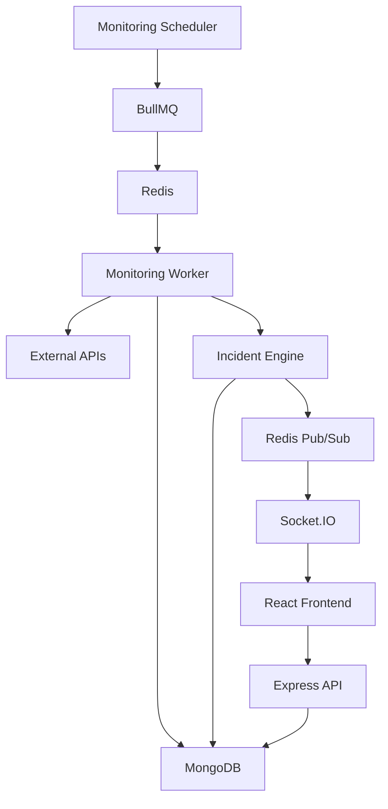

# API Sentinel
API Sentinel is a full-stack API monitoring and incident management platform that continuously checks configured APIs, detects failures, creates incidents, and provides real-time updates through a web dashboard.

## Project Status

The core MVP of API Sentinel is implemented and functional, including API monitoring, background job processing, incident management, real-time updates, dashboard analytics, and authentication.

Further improvements such as containerization, deployment, automated testing, and additional production-oriented features can be added as future enhancements.

## Features

- User registration and login with JWT authentication
- Create, edit, enable, disable, and delete API monitors
- Scheduled API health checks using BullMQ workers
- Check history with response status, response time, and errors
- Automatic incident creation after consecutive failures
- Incident acknowledgement and resolution
- Real-time monitor and incident updates using Socket.IO
- Dashboard with monitor health and incident statistics
- Monitor analytics and response-time charts using Recharts

## Project Highlights

- Designed a background monitoring pipeline using a scheduler, BullMQ, Redis, and a dedicated monitoring worker.
- Implemented consecutive-failure detection and automated incident creation and recovery.
- Built real-time monitor and incident updates using Socket.IO with a Redis Pub/Sub bridge.
- Implemented JWT-based authentication and protected API routes.
- Built monitor check history and analytics for tracking API health and response times.
- Developed a React dashboard for monitoring API health, incidents, and analytics.

## Tech Stack

### Frontend
- React
- React Router
- Socket.IO Client
- Recharts
- Vite

### Backend
- Node.js
- Express.js
- MongoDB
- Mongoose
- JWT
- bcrypt

### Background Processing & Real-Time
- Redis
- BullMQ
- Socket.IO
- Redis Pub/Sub

### Development & Tools
- Postman
- Git & GitHub

## Architecture

API Sentinel follows a background-job-based monitoring architecture:


### Monitoring Flow

1. The scheduler identifies monitors that are due for a check.
2. A monitoring job is added to the BullMQ queue.
3. Redis manages the queued job.
4. The monitoring worker processes the job.
5. The worker sends an HTTP request to the monitored API.
6. The check result is stored in MongoDB.
7. The incident engine evaluates failures and recovery conditions.
8. Relevant events are published through Redis Pub/Sub.
9. Socket.IO delivers real-time events to connected React clients.
10. The frontend updates the dashboard without requiring a page refresh.

### Incident Management

API Sentinel uses consecutive monitor failures to determine when an incident should be created.

1. A monitor check fails.
2. The failure count is updated.
3. When the configured failure threshold is reached, an incident is created.
4. Users can acknowledge an active incident from the dashboard.
5. When subsequent checks confirm recovery, the incident is resolved.
6. Incident state changes are published as real-time events and reflected in the frontend.

### Real-Time Updates

API Sentinel uses Socket.IO with a Redis Pub/Sub bridge to deliver monitoring and incident events to connected frontend clients.

1. The monitoring worker detects a monitor or incident state change.
2. The backend publishes the event through Redis Pub/Sub.
3. The Socket.IO layer receives the published event.
4. Connected React clients receive the event through Socket.IO.
5. The frontend updates the relevant UI without requiring a page refresh.

Real-time events include monitor status changes and incident creation, acknowledgement, and resolution.

## Project Structure

```text
API-Sentinel/
├── docs/                   # Project documentation and requirements
├── frontend/              # React + Vite frontend application
├── server/                # Node.js + Express backend application
├── .gitignore             # Files and folders excluded from Git
└── README.md              # Project documentation
```

## Getting Started

### Prerequisites

Before running API Sentinel locally, make sure the following are installed and available:

- Node.js
- npm
- MongoDB
- Redis
- Git

### Clone the Repository

Clone the repository and move into the project directory:

```bash
git clone https://github.com/Vishwajeet-Gupta-001/API-Sentinel.git
cd API-Sentinel
```
### Backend Setup

Navigate to the backend directory and install the required dependencies:

```bash
cd server
npm install
```

Create a `.env` file inside the `server` directory using `.env.example` as a reference.

The backend requires the following environment variables:

```env
PORT=5000
MONGODB_URI=<your-mongodb-connection-string>
JWT_SECRET=<your-jwt-secret>
REDIS_URL=redis://127.0.0.1:6379
```

Do not commit the `.env` file to GitHub.

#### Start the Backend

From the `server` directory, start the backend server and monitoring worker:

```bash
npm run dev
```

This starts both the Express API server and the monitoring worker.

The API server runs on:

```text
http://localhost:5000
```
### Frontend Setup

Open a new terminal, navigate to the frontend directory, and install the required dependencies:

```bash
cd frontend
npm install
```

Start the frontend development server:

```bash
npm run dev
```

The frontend will be available at the local URL shown by Vite, typically:

```text
http://localhost:5173
```

## Usage

Once API Sentinel is running:

1. Register a new account or log in with an existing account.
2. Create a monitor by providing the target API URL and monitoring configuration.
3. Enable the monitor to allow scheduled health checks.
4. View the monitor's current status and check history from the dashboard.
5. When repeated failures reach the configured threshold, an incident is created automatically.
6. Review and acknowledge active incidents from the incident management interface.
7. When the monitored API recovers, the incident is resolved automatically.
8. Use the analytics section to review monitoring and response-time data.
9. Real-time monitor and incident changes are reflected in the dashboard through Socket.IO.

## Testing

API Sentinel has been manually verified across the main application flows, including:

- User registration and login
- JWT-protected routes
- Monitor creation, editing, enabling, disabling, and deletion
- Scheduled monitoring through BullMQ and the monitoring worker
- Check history and failure reporting
- Automatic incident creation and recovery
- Incident acknowledgement and resolution
- Real-time monitor and incident updates through Socket.IO
- Dashboard statistics and monitor analytics

API endpoints can be tested using Postman, while the frontend can be verified through the running React application.

## License

API Sentinel is licensed under the MIT License. See the [LICENSE](LICENSE) file for details.